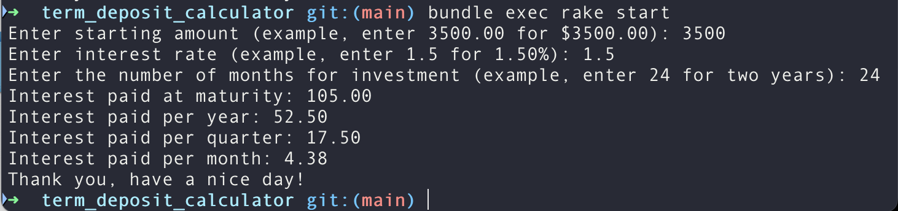

# TermDepositCalculator

## Description

A CLI tool that calculates interest paid for a term deposit when a user specifies the starting amount, interest rates, and investment period.



## Installation

Steps to install dependencies and set up the project.

1. Git Clone

2. Install Ruby your way, or run this

   ```
   # using homebrew and rbenv
   brew install rbenv
   rbenv init

   rbenv install -l         # List all available versions
   rbenv install 3.4.4      # Or the latest shown
   rbenv global 3.4.4
   ```

3. Install Bundler

   ```
   gem install bundler
   ```

4. Install dependencies

   ```
   bundle install
   ```

5. Start the app and input the starting amount, interest rate and investment term (in months)
   ```
   bundle exec rake start
   ```

## Usage

1. To start the app via the terminal:

   ```
   bundle exec rake start
   ```

2. To run rspec tests:

   ```
   bundle exec rspec

   # Or run a specific test file
   bundle exec rspec spec/cli_spec.rb
   ```

3. To run rubocop for linting:

   ```
   bundle exec rubocop
   ```
