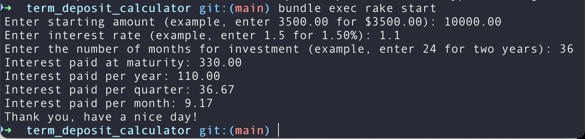

# Thoughts

### Whiteboard Design

 

Simple whiteboard design

### Code Considerations

1. Single Responsibility Principle (SRP):

- Where applicable, methods and classes do only one thing.
- Each class has a single responsibility, with clear Separation of Concerns. For instance:
  - CLI: Handles user interaction & validation.
  - Money: Represents Money with value precision.
  - Calculator: Handles calculation.

2. Open/Closed Principle (OCP):

- Classes and methods are open for extension but closed for modification. Using the constant `PROMPTS` inside CLI#run in a loop makes modification easier. For instance, when new prompts are required, the list can be modified.

3. Liskov Substitution Principle (LSP) & Dependency Inversion Principle (DIP):

- The Money class can be substituted with a money like object.
- Abstracting `money_class` and `calculator_class` allows other classes that "quacks like a duck" to replace them so they can be updated, changed or scaled independently.
- Another great example, is when lamdas inside CLI#run to convert user prompts to the desired format. If there's any domain change, the lambas are used inside CLI#run to convert user inputs to the desired type for processing.

4. Don't Repeat Yourself (DRY):

- Eliminating code duplication where possible. For instance, when prompting for user input, we would be repeating 3 user prompts and 3 gets.chomp. Including these in a loop and utilising an object of prompts can help make the code DRYer.
- At one point, CLI#run and user prompting code was procedural for explicicity, however this was later updated for Idiomatic Ruby.

5. You aren't gonna need it (YAGNI):

- Build only what is necessary in the requirements, don't overthink or over engineer and predict how the requirements might asked later for this interview process.

6. Time & Space Complexity Mindset:

- Time Complexity is 0(1) because the number of prompts is a constant 3 while the number of interest paid periods is another constant 4. Converting inputs and calculations are all constant time operations!
- Space Complexity is 0(1) because only a small fixed number of values in memory.

7. Metaprogramming:

- Using a `.send` dynamically calls a method based on a string a runtime.

8. Input Validation and Error Handling:

- User inputs are validated for convertable types.
- Invalid inputs such as negative numbers or words are handle where the CLI exits and displays an error message.

9. Testability:

- The code is test-friendly by design because `calculator_class` and `money_class` into CLI, which fully decouples the business logic.

These were some of my thoughts and considerations, curious to know yours!

### Assumptions

1. I have built a `Term Deposit Calculator` with an `Income Stream` Interest Payment Type. Not `Re-invest` Interest Payment Type.
2. We are only dealing with a sub unit currency format that uses uses 2 decimal places (.00) i.e AUD, USD, SGD or MYR.

### Screenshots

 

Working Example 1

CLI

Bendigo Website

Working Example 2

CLI

Bendigo Website

 

Rspec passing

